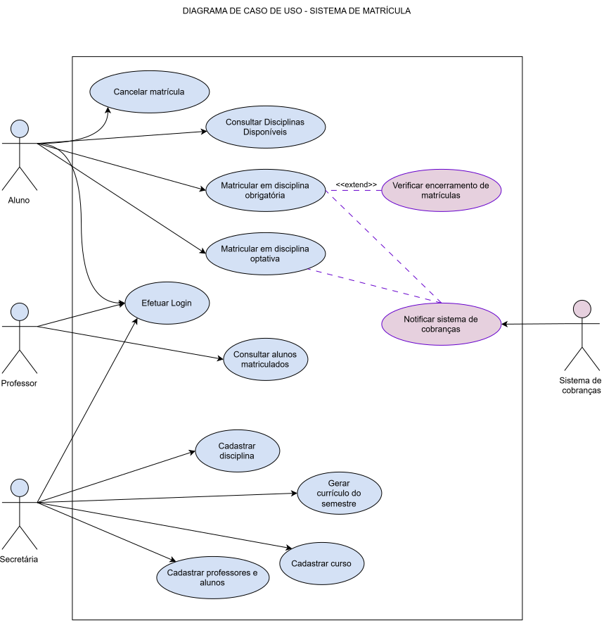

# Sistema de Matrículas — PUC Minas

**Curso:** Engenharia de Software
**Disciplina:** Projeto de Software
**Laboratório 2 — Segundo Semestre/2026**
**Entrega:** Lab01S01 — Modelo de Análise (4 pontos)

---

## 1. Descrição do Sistema

O Sistema de Matrículas tem como objetivo informatizar o processo de matrícula de uma universidade. A Secretaria gera o currículo de cada semestre e mantém as informações sobre cursos, disciplinas, professores e alunos. Os alunos podem se matricular em até 4 disciplinas obrigatórias e 2 disciplinas optativas durante o período de matrículas, podendo também cancelar matrículas já realizadas nesse mesmo período.

Uma disciplina só é oferecida no semestre seguinte se atingir, ao final do período de matrículas, no mínimo 3 alunos inscritos; caso contrário, é cancelada. O limite máximo de vagas por disciplina é de 60 alunos — ao atingir esse número, as inscrições são automaticamente encerradas. Sempre que um aluno se matricula, o Sistema de Cobranças é notificado para que a cobrança do semestre seja gerada. Professores podem consultar quais alunos estão matriculados em suas disciplinas. Todos os usuários (alunos, professores e secretaria) acessam o sistema por meio de login e senha.

---

## 2. Diagrama de Caso de Uso



**Atores identificados:**

| Ator | Descrição |
|---|---|
| **Aluno** | Realiza login, consulta disciplinas, matricula-se e cancela matrículas. |
| **Professor** | Realiza login e consulta os alunos matriculados em suas disciplinas. |
| **Secretaria** | Realiza login, gera o currículo do semestre e cadastra cursos, disciplinas, professores e alunos. |
| **Sistema de Cobranças** (ator secundário/externo) | Recebe a notificação de matrícula para gerar a cobrança do aluno. |

---

## 3. Histórias de Usuário

### US01 — Login no sistema
**Como** usuário do sistema (aluno, professor ou secretaria),
**eu quero** efetuar login com usuário e senha,
**para que** eu possa acessar as funcionalidades do sistema de acordo com meu perfil.

**Critérios de aceite:**
- O sistema deve validar as credenciais cadastradas antes de liberar o acesso.
- Em caso de usuário ou senha inválidos, o sistema deve exibir uma mensagem de erro clara.
- Cada perfil (aluno, professor, secretaria) deve visualizar apenas as funcionalidades permitidas ao seu tipo de usuário.

---

### US02 — Consultar disciplinas disponíveis
**Como** aluno,
**eu quero** consultar as disciplinas oferecidas no período de matrícula,
**para que** eu possa escolher em quais desejo me matricular.

**Critérios de aceite:**
- Deve exibir nome da disciplina, curso associado, número de vagas ocupadas/disponíveis e se é obrigatória ou optativa.
- Disciplinas que já atingiram 60 alunos matriculados devem aparecer como "inscrições encerradas".

---

### US03 — Matricular-se em disciplina obrigatória
**Como** aluno,
**eu quero** me matricular em até 4 disciplinas obrigatórias,
**para que** eu possa cursar as disciplinas do meu currículo no próximo semestre.

**Critérios de aceite:**
- O sistema deve impedir a matrícula em uma 5ª disciplina obrigatória.
- O sistema não deve permitir matrícula em disciplina que já atingiu 60 alunos inscritos.
- Ao atingir 60 alunos, as inscrições da disciplina devem ser encerradas automaticamente.
- Ao concluir a matrícula, o Sistema de Cobranças deve ser notificado (inclui US12).

---

### US04 — Matricular-se em disciplina optativa
**Como** aluno,
**eu quero** me matricular em até 2 disciplinas optativas,
**para que** eu possa complementar minha formação acadêmica.

**Critérios de aceite:**
- O sistema deve impedir a matrícula em uma 3ª disciplina optativa.
- Aplicam-se as mesmas regras de limite de vagas (60 alunos) e notificação ao Sistema de Cobranças (US03).

---

### US05 — Cancelar matrícula
**Como** aluno,
**eu quero** cancelar uma matrícula realizada anteriormente, durante o período de matrículas,
**para que** eu possa ajustar as disciplinas escolhidas antes do início do semestre.

**Critérios de aceite:**
- O cancelamento só pode ocorrer dentro do período de matrículas.
- A vaga liberada deve ficar novamente disponível para outros alunos.

---

### US06 — Encerramento automático do período de matrículas
**Como** secretaria,
**eu quero** que o sistema verifique, ao final do período de matrículas, quantos alunos estão inscritos em cada disciplina,
**para que** disciplinas com menos de 3 alunos sejam automaticamente canceladas e as demais confirmadas para o semestre seguinte.

**Critérios de aceite:**
- Disciplinas com 3 ou mais alunos inscritos ao final do período tornam-se ativas.
- Disciplinas com menos de 3 alunos inscritos são canceladas automaticamente.
- Alunos matriculados em disciplinas canceladas devem ser notificados.

---

### US07 — Consultar alunos matriculados
**Como** professor,
**eu quero** consultar a lista de alunos matriculados em cada disciplina que leciono,
**para que** eu possa me preparar para o semestre letivo.

**Critérios de aceite:**
- A lista deve exibir nome dos alunos matriculados por disciplina.
- Somente disciplinas vinculadas ao professor logado devem ser exibidas.

---

### US08 — Gerar currículo do semestre
**Como** secretaria,
**eu quero** gerar o currículo com as disciplinas oferecidas em cada semestre,
**para que** os alunos possam realizar suas matrículas.

**Critérios de aceite:**
- O currículo deve conter as disciplinas vinculadas a cada curso.
- O currículo deve ficar visível aos alunos durante o período de matrículas.

---

### US09 — Cadastrar curso
**Como** secretaria,
**eu quero** cadastrar cursos informando nome e número de créditos,
**para que** os cursos estejam disponíveis para associação de disciplinas.

**Critérios de aceite:**
- Não deve ser possível cadastrar um curso sem nome ou sem número de créditos.

---

### US10 — Cadastrar disciplina
**Como** secretaria,
**eu quero** cadastrar disciplinas vinculadas a um curso,
**para que** elas possam compor o currículo de um semestre.

**Critérios de aceite:**
- Toda disciplina deve estar associada a um curso existente.
- O limite máximo de vagas (60) deve ser definido por padrão na criação da disciplina.

---

### US11 — Cadastrar professores e alunos
**Como** secretaria,
**eu quero** cadastrar professores e alunos no sistema,
**para que** eles possam efetuar login e utilizar as funcionalidades do seu perfil.

**Critérios de aceite:**
- O cadastro deve exigir usuário e senha para acesso ao sistema.
- Não deve ser possível cadastrar dois usuários com o mesmo login.

---

### US12 — Notificar o Sistema de Cobranças
**Como** Sistema de Matrículas,
**eu quero** notificar o Sistema de Cobranças sempre que um aluno se matricular em disciplinas de um semestre,
**para que** o aluno seja corretamente cobrado pelas disciplinas cursadas.

**Critérios de aceite:**
- A notificação deve ocorrer automaticamente a cada nova matrícula concluída.
- A notificação deve conter aluno, semestre e disciplinas matriculadas.

---

## 4. Organização do Repositório

```
├── README.md
├── artefatos/
│   ├── diagramaSistema.svg          # Diagrama de Caso de Uso (Lab01S01)
│   └── LABORATORIO_2_LAB_DESENVOLVIMENTO_DE_SOFTWARE.pdf
├── docs/
│   └── superpowers/specs/           # Documento de design da estrutura
└── sistema-matriculas/              # Projeto Java (Lab01S02)
    ├── pom.xml
    └── src/main/java/br/pucminas/matriculas/
        ├── model/                   # Entidades e enums
        ├── repository/              # Interfaces Spring Data JPA
        ├── service/                 # Regras de negócio
        ├── controller/              # Orquestração
        ├── ui/                      # Interface de linha de comando
        ├── integration/             # Sistema de Cobranças (ator externo)
        ├── exception/               # Exceções de regra de negócio
        └── config/                  # Carga inicial de dados
```

## 5. Projeto Java

O sistema é desenvolvido em **Java 21** com **Spring Boot**, persistência em **H2** (banco em arquivo) via Spring Data JPA e interface de **linha de comando**.

| Camada | Responsabilidade |
|---|---|
| `model` | Entidades do domínio — é o que o Diagrama de Classes representa. |
| `repository` | Acesso ao banco (interfaces Spring Data). |
| `service` | Todas as regras de negócio: limites de 4/2 disciplinas, mínimo de 3 e máximo de 60 alunos, período de matrícula. |
| `controller` | Traduz a entrada da interface em chamadas de serviço. |
| `ui` | Menus de console por perfil (aluno, professor, secretaria). |

**Executar:**

```bash
cd sistema-matriculas
mvn spring-boot:run
```

> **Estado atual (Lab01S02):** classes, atributos e assinaturas de métodos.
> Os métodos ainda não implementados lançam `UnsupportedOperationException("Implementar no Lab01S03")`.

## 6. Autores
- [MarinaSDiniz](https://github.com/MarinaSDiniz)
- [Mariana Tavares](https://github.com/Mari492)
- [Milena Cardoso](https://github.com/milenacrd)
- [Caio Félix](https://github.com/caiofelixreis)
